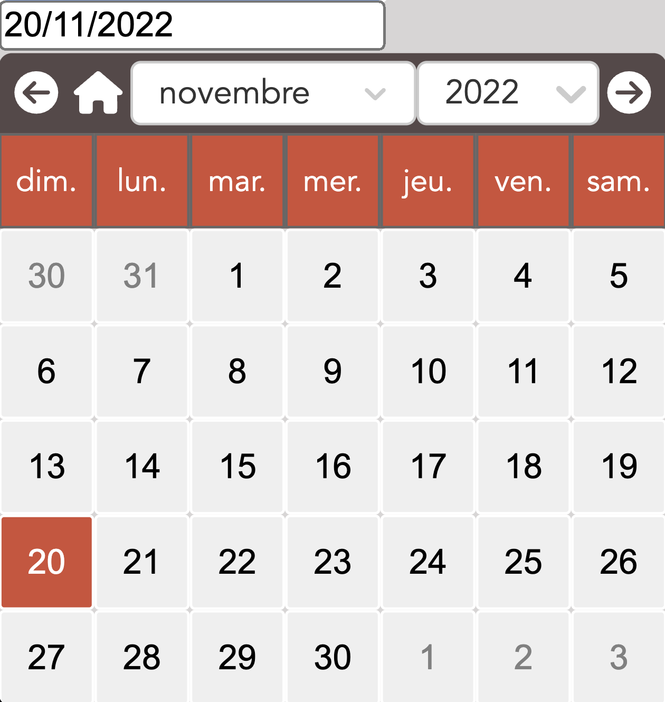

# React-DatePicker

React-DatePicker, created by Hugo DELAHAYE aims to provide your project with the possibility to have a calendar based on an Input, visually identifiable.


Features include:

- The user can navigate the calendar by moving to the next and previous month with two arrow icons
- The user can return to the current month by clicking on the house icon
- The user can choose the month via a selector that offers all possible months
- The user can choose the year via a selector that offers all possible years
- As a developer, you have the possibility to choose the minimum year that will be proposed in the calendar and the maximum year
- As a developer, you have the possibility to choose the language of the calendar. This will impact the days of the week as well as the list of months
- As a developer, you have the possibility to customize the calendar via the class-toggle
- The returned date will have the format you want. This format is based on method of date-fns library

Link npm package : [link](https://www.npmjs.com/package/@hugo.delahaye53/react-datepicker).
# Installation and usage

The easiest way to use react-select is to install it from npm and build it into your app with Webpack.

```
yarn add @hugo.delahaye53/react-datepicker
```

or with this command :

```
npm install @hugo.delahaye53/react-datepicker
```

Then use it in your app:

```js
import React from 'react';
import {Calendar} from "@hugo.delahaye53/react-datepicker";
import "@hugo.delahaye53/react-datepicker/dist/esm/styles/style.css";

export default function App() {
  return (
    <div className="App">
      <Calendar
        yearMin={1950}
        yearMax={2050}
        languageChoice={"enUS"}
        returnFormat={"MM/dd/yyyy"}
        defaultDate={new Date()}
        labelContent={"Date"}
      />
    </div>
  );
}
```

## Props

Common props you may want to specify include:

- `yearMin` - define the first available year in the calendar
- `yearMax` - define the last available year in the calendar
- `language` - define the language of the calendar; this will concern the days of the week as well as the name of the months
- `returnFormat` - define the output format of the expected date
- `defaultDate` - define the date display by default in the input
- `labelContent` - define the text of the label
- `classChange` - give your own class for custom the calendar (props not required)
- `nameInput` - choice name attribute for input (props not required)
- `handleDateChanged` - return value when the returnValue on input change (props not required)


## More explication for many props

- `yearMin` / `yearMax` - As previously mentioned, they allow you to create an interval between the starting year and the proposed end year. The expected values are numbers. An interval of 1000 years is defined with respect to the current year. This means that if we are in 2022, the first year cannot be less than 1022, and the last year cannot be more than 3022. This is for performance reasons.
- `language` - The choice of language can be very useful depending on which audience will use your application. The available languages are provided through the date-fns library where you can consult the documentation to see what languages are available via [this link](https://date-fns.org/docs/Getting-Started).
- `inputValue` / `onInputChange` - control the value of the search input (changing this will update the available options)
- `returnFormat` - The returned date format is based on a method of the date-fns library named format. The documentation is at this link: [this link](https://date-fns.org/v2.29.3/docs/format).

## Customisation
You can add your class with the props classChange.
Don't forget import this file :
```js
import "@hugo.delahaye53/react-datepicker/dist/esm/styles/style.css";
```
# Mentions

This project uses npm [react-select package](https://www.npmjs.com/package/react-select) to create a drop-down menu with items and offers many features.

## License

Common Licence. Copyright (c) Hugo DELAHAYE 2022.